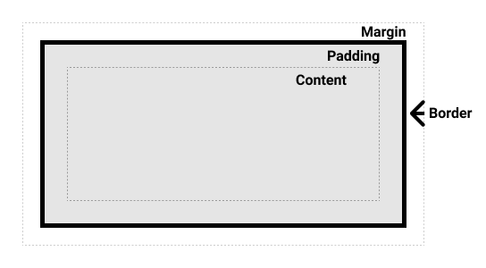

# CSS

마크업언어 (ex: html)이 몸체라면 CSS는 옷을 입히는 언어이다.

같은 HTML 코드를 사용했더라고 해도 CSS를 사용하여 전혀 다른 분위기의 웹사이트를 만들 수 있다.

# CSS 박스 모델

웹페이지에서 모든 HTML 요소는 3개의 층을 가진 사각형의 구조를 띄고 있다.

## 박스 모델 종류

- **콘텐츠 영역**
- **안쪽 여백 영역(패딩)**
- **테두리 영역 (보더)**
    
    [Border](Border%20a99f48aa8ea94b3c8624adb8cd49a877.md)
    
- **바깥 여백 영역(마진)**
    
    [Margin area](Margin%20area%2068264d2842804b36a12993d5f6ed007a.md)