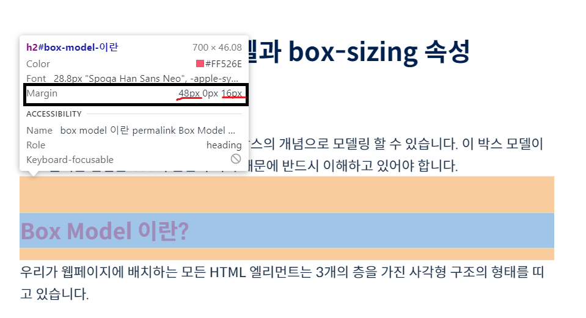

# Margin area

테두리(border) 바깥의 여백을 표현한다.

요소와 요소 사이의 여백을 표현한다.

마진은 top, left, bottom, right 네 방향을 설정한다.

```jsx
margin:10px; /*모든 방향으로 margin이 10px가 된다*/
margin:10px 20px; /*상하, 좌우를 10, 20px으로 설정한다*/
margin:10px 20px 30px; /*상, 좌우, 하의 margin을 10, 20, 30px로 설정한다*/
margin:10px 20px 30px 40px; /*상, 좌, 하, 우 margin을 10, 20, 30, 40px로 설정한다*/
margin:auto; /*수평 방향 마진을 자동으로 설정한다*/

margin-top:10px;
margin-right:-30px; /*margin값을 음수로 설정한다면 다른 요소와 겹치게 할 수도 있다*/
margin-botton:10px;
margin-left:10px;

/*위와 같은 방식으로도 설정할 수 있다*/
```



이 마진 영역은 background-color 로 색을 지정할 수 없다.